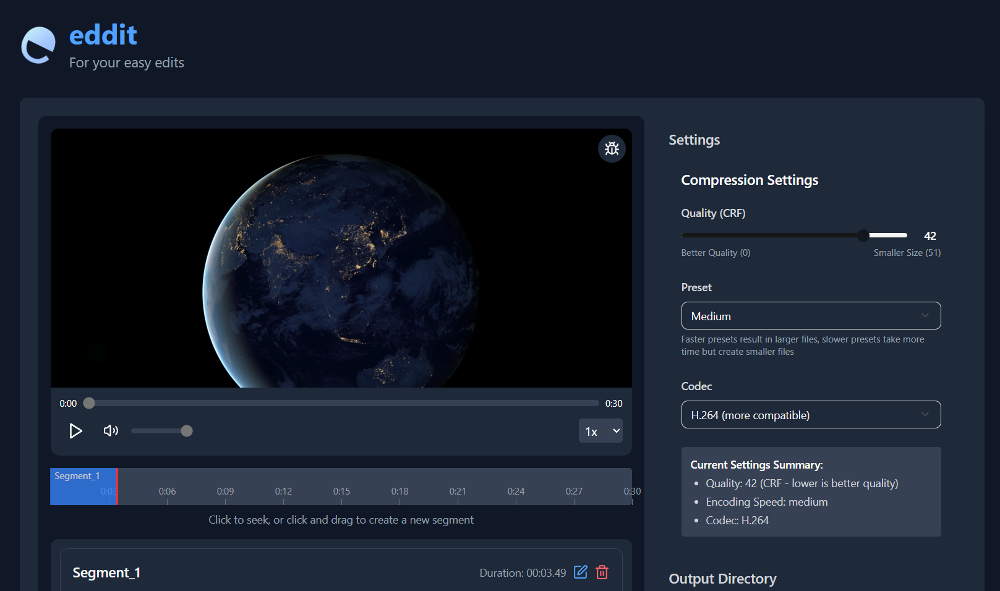

# Eddit 🎬

<p align="center">
  
</p>

<p align="center">
  <strong>A powerful video editing tool for cutting, compressing, and processing visuals</strong>
</p>

<p align="center">
  <a href="#features">Features</a> •
  <a href="#installation">Installation</a> •
  <a href="#usage">Usage</a> •
  <a href="#development">Development</a> •
  <a href="#contributing">Contributing</a> •
  <a href="#license">License</a>
</p>

<p align="center">
  
</p>

<p align="center">
  
</p>

## 📥 Download Latest Version

| Platform | Installer | Type |
|----------|-----------|------|
| Windows | [Download .msi](https://github.com/AbdulKhadhar/eddit/releases/latest/download/eddit_0.1.0_x64_en-US.msi) | Recommended for most users |
| Windows | [Download .exe](https://github.com/AbdulKhadhar/eddit/releases/latest/download/eddit_0.1.0_x64-setup.exe) | Alternative installer |

## ✨ Features

- **Video Cutting** - Segment videos with frame-accurate precision
- **Custom Intro Addition** - Seamlessly add intro clips to each segment
- **Video Compression** - Optimize file size while maintaining quality
- **Batch Processing** - Handle multiple videos simultaneously
- **Fast Performance** - Powered by FFmpeg for efficient processing
- **Modern Interface** - Intuitive UI built with Tailwind CSS 4
- **Cross-Platform** - Built with Tauri 2 for compatibility across systems

## 🖥️ Screenshot


## 🚀 Installation

### For Users

1. **Download** the installer for your platform from the links above
2. **Run** the installer and follow the on-screen instructions
3. **Launch** Eddit from your applications menu or desktop shortcut

### For Developers

#### Prerequisites

- [Node.js](https://nodejs.org/) (v22.12.0 or latest stable)
- [pnpm](https://pnpm.io/installation) (recommended package manager)
- [Rust & Cargo](https://www.rust-lang.org/tools/install) (latest stable)
- [Git](https://git-scm.com/downloads)

#### Setup

1. **Clone the repository**

```bash
git clone https://github.com/AbdulKhadhar/eddit.git
cd eddit
```

2. **Unzip FFmpeg components**

After cloning, you need to unzip FFmpeg components:
- Unzip `src-tauri/bin/ffmpeg.zip` and `src-tauri/bin/ffprobe.zip` to the same folder (`src-tauri/bin/`)

3. **Install dependencies**

```bash
pnpm install
```

## 💻 Development

### Running in Development Mode

```bash
pnpm tauri dev
```

### Building for Production

```bash
pnpm tauri build
```

## 🛠️ Tech Stack

- **Frontend**: 
  - React with TypeScript
  - Tailwind CSS 4
  - Vite
  
- **Backend**:
  - Tauri 2 (Rust)
  - FFmpeg for video processing

## 🤝 Contributing

Contributions are welcome and appreciated! Here's how you can contribute:

1. **Fork** the repository
2. **Create a branch** for your feature (`git checkout -b feature/amazing-feature`)
3. **Commit** your changes (`git commit -m 'Add some amazing feature'`)
4. **Push** to the branch (`git push origin feature/amazing-feature`)
5. **Open a Pull Request**

Please make sure to update tests as appropriate and adhere to the project's code style.

## 📜 License

This project is licensed under the [MIT License](LICENSE).

## 🌟 Support

If you find Eddit useful, please consider:
- Giving it a star on GitHub
- Sharing it with others who might benefit
- Providing feedback through issues

## 📬 Contact

For issues, suggestions, or questions:
- Open an [issue](https://github.com/AbdulKhadhar/eddit/issues) on GitHub
- Connect on [LinkedIn](https://www.linkedin.com/in/abdul-khadar/)

---

<p align="center">
  Made with ❤️ by <a href="https://github.com/AbdulKhadhar">Abdul Khadhar</a>
</p>